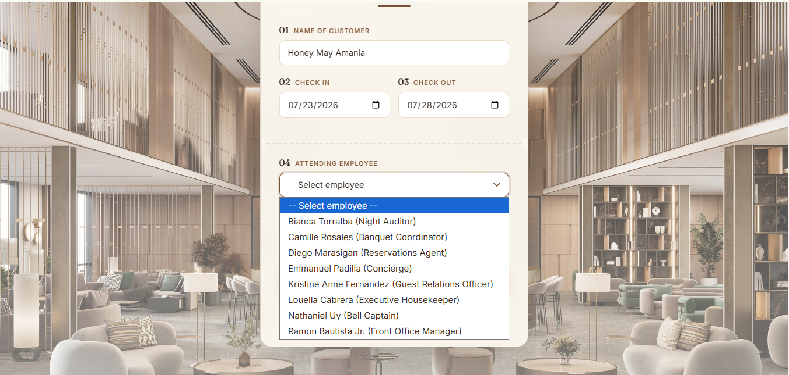
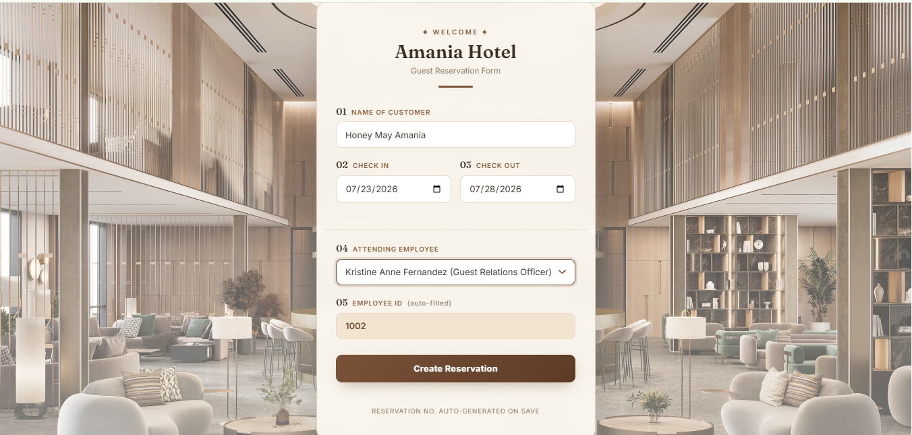
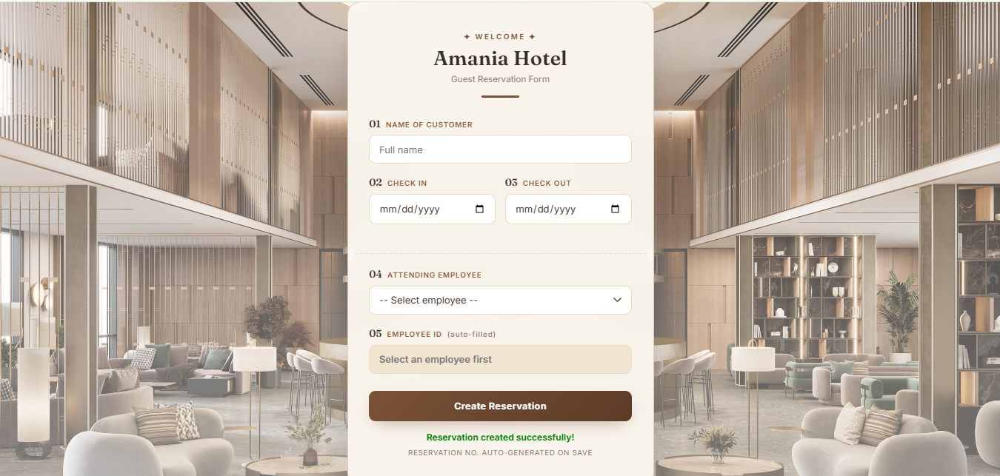
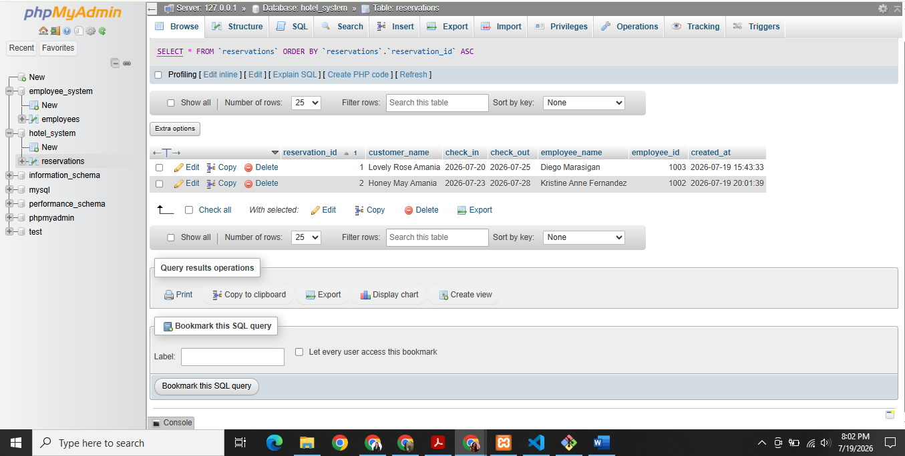
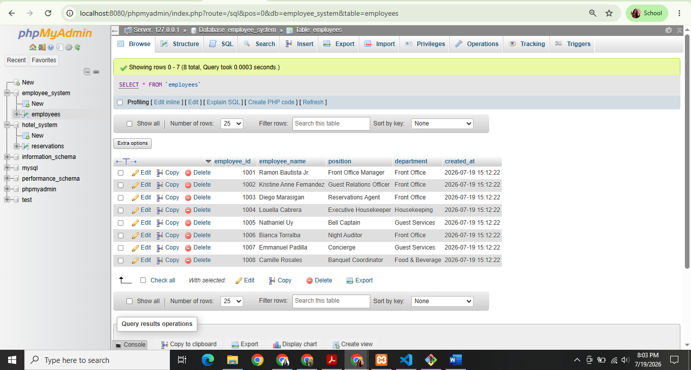

# Hotel System ↔ Employee System Activity

This project recreates the diagram: two separate systems (Hotel System and
Employee System) that talk to each other over an API.

- **Employee System** (pc2 / webserver2): owns the `employees` table and exposes
  `get_employees.php`, which returns all employees as JSON.
- **Hotel System** (pc1 / webserver1): shows a reservation form. Its frontend
  fetches the employee list from the Employee System's API to populate the
  "Employee Name" dropdown, then submits the finished reservation to its own
  backend, which stores it in the `hotel_system` database.

## Folder structure
```
project/
├── database/
│   ├── employee_system.sql   -> creates & seeds the employee database
│   └── hotel_system.sql      -> creates the reservations table
├── employee_system/
│   ├── db_config.php         -> connects to employee_system DB
│   └── get_employees.php     -> API: returns employees as JSON
├── hotel_system/
│   ├── db_config.php         -> connects to hotel_system DB
│   ├── index.php             -> reservation form (frontend)
│   ├── script.js             -> fetches employees + submits reservation
│   └── create_reservation.php-> stores reservation in DB
└── screenshots/              -> proof-of-functionality screenshots (see below)
```

## How to run it locally (XAMPP / MAMP / WAMP)

1. **Install MySQL + PHP** (XAMPP is easiest — start Apache and MySQL).
2. **Create the databases**: open phpMyAdmin (or the `mysql` CLI) and run
   `database/employee_system.sql`, then `database/hotel_system.sql`.
3. **Simulate two servers on one machine** by running two PHP servers on
   different ports (this stands in for "pc1" and "pc2"):
   ```bash
   # Terminal 1 — Employee System (pc2)
   cd employee_system
   php -S localhost:8080

   # Terminal 2 — Hotel System (pc1)
   cd hotel_system
   php -S localhost:8000
   ```
4. In `hotel_system/script.js`, make sure `EMPLOYEE_API_URL` points at the
   Employee System's address (`http://localhost:8080/get_employees.php` if
   you use the command above — adjust the path if it's under a folder).
5. Open **http://localhost:8000** in your browser. The "Employee Name"
   dropdown should populate from the Employee System automatically. Fill out
   the form and submit — it stores the reservation in `hotel_system`.

## Mapping to the guide steps you were given

| Guide step | Where it lives |
|---|---|
| Create the Hotel System frontend | `hotel_system/index.php` |
| Connect Hotel System to a database | `hotel_system/db_config.php` |
| Create database for hotel system | `database/hotel_system.sql` |
| Hotel system's Create function working | `hotel_system/create_reservation.php` |
| Create database for employee system | `database/employee_system.sql` |
| PHP script returning employees as JSON | `employee_system/get_employees.php` |
| Frontend script populating the dropdown | `hotel_system/script.js` (`loadEmployees`) |
| Full flow: create reservation + dropdown from API | Run both servers and use `index.php` |

## Submitting the activity

1. **Push to GitHub**
   ```bash
   git init
   git add .
   git commit -m "Hotel system and employee system activity"
   git branch -M main
   git remote add origin https://github.com/<your-username>/<repo-name>.git
   git push -u origin main
   ```
   Make sure the repo's visibility is set to **Public** (GitHub repo Settings →
   Danger Zone → Change visibility, or set it to Public when you first create
   the repo).

2. **Zip the code**
   ```bash
   zip -r hotel-employee-system.zip project/
   ```

3. Submit both the **GitHub repo link** and the **zip file** as instructed.

## Proof of functionality

Screenshots below show the full flow working end-to-end: the Employee System
database, the Hotel System form with the dropdown populated from the
Employee System's API, a successful reservation submission, and the saved
record inside the `hotel_system` database.

**1. Employee dropdown populated via API fetch from the Employee System**


**2. Reservation form filled out — Employee ID auto-fills once an employee is selected**


**3. Reservation created successfully**


**4. `hotel_system` → `reservations` table — saved records proving the Create/Store function works**


**5. `employee_system` → `employees` table — source data the Hotel System dropdown reads from**

